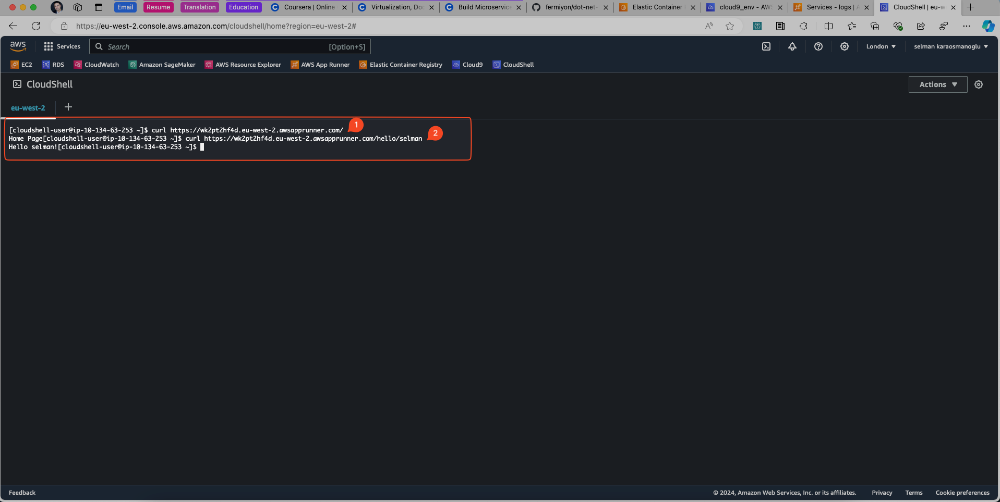

By Selman Karaosmanoglu 

## Date created
3 July 2024

# C# .NET 6 Docker Deployment on AWS

.NET 6 on AWS for Containers using Cloud9

## Architecture


## Setting Up AWS Cloud9

### Create AWS Cloud9 Environment


### Modify Cloud9 Volume

Go to the running EC2 instance of Cloud9 


Modify volume size to 60GB


### Reboot Cloud9

```bash
sudo reboot
```


### Control the new size of the volume

```bash
df --human-readable
```


### Install .NET 6 from Microsoft

```bash
sudo rpm -Uvh https://packages.microsoft.com/config/centos/7/packages-microsoft-prod.rpm
sudo yum install dotnet-sdk-6.0
sudo yum install aspnetcore-runtime-6.0
sudo yum install dotnet-runtime-6.0
```

### Run dotnet

```bash
cd WebServiceAWS

dotnet run
```


### Test with curl

```bash
curl http://localhost:5262

curl http://localhost:5262/hello/aws
```


### Create Amazon Elastic Container Registry


View and copy push commands


### Build Docker Image

The Dockerfile is as follows:

```bash
FROM mcr.microsoft.com/dotnet/sdk:6.0 AS build
WORKDIR /src
COPY ["WebServiceAWS.csproj", "./"]
RUN dotnet restore "WebServiceAWS.csproj"
COPY . .
WORKDIR "/src/."
RUN dotnet build "WebServiceAWS.csproj" -c Release -o /app/build

FROM build AS publish
RUN dotnet publish "WebServiceAWS.csproj" -c Release -o /app/publish

FROM mcr.microsoft.com/dotnet/aspnet:6.0 AS base
WORKDIR /app
EXPOSE 8080
ENV ASPNETCORE_URLS=http://+:8080

WORKDIR /app
COPY --from=publish /app/publish .
ENTRYPOINT ["dotnet", "WebServiceAWS.dll"]
```

Run the below command to build docker image from Dockerfile.

```bash
docker build . -t web-service-dotnet:latest
```


### Apply push commands

```bash
docker tag ..

docker push ..
```


### Create App Runner service


Configure App Runner


Successfull deploy screen


### Control from AWS cloud shell



## Reference

* Duke University - Virtualization, Docker, Kubernetes Data Engineering Program
